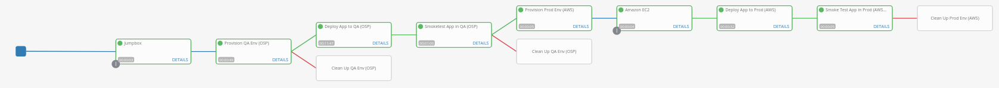

# Ansible Homework Assignment

## Basic Requirements

* GitHub repo: https://github.com/kmendez-redhat/ansible-homework
* The thre-tier app playbooks have been incorporated within the above repo (Configure_3TA_AWS.yml,Configure_3TA_OSP.yml)
* An HA Ansible tower installation was implemented during class and again afterwards. It is located here https://tower1.5c31.example.opentlc.com with the login credentials from class

## Provision QA Environment (including smoke test)

* This is accomplished using the Provision_OSP.yml playbook with applicable roles in the roles directory
* The smoke test is implemented in smoketest_OSP.yml
* The OpenStack jump box credentials are stored in the *JumbBox* credential on the tower server
* The download location for the openstack pem is stored in tower, as a variable in the *OpenStack* inventory

## Provision Production Environment (including smoke test)

* The AWS environment is expected to be provisioned using opentlc. There is a Provision_AWS.yml playbook however it just logs a debug message and assumes the AWS environment has already been provisioned.
* The credentials to the AWS bastion server are stored on tower in the *AWS Machine Credentials* credential. This must be updated whenever the AWS environment is recreated
* The vault credential is stored on tower in the *Vault* credential
* The smoke test is implemented in smoketest_AWS.yml

## Design Ansible Tower Workflow Job Template

* The workflow job template is stored on the tower server as *Homework Main Worklflow*

Steps:
1. Updates the jumpbox inventory to pick up the correct openstack jumpbox server.
2. Provision the VMs for 3 tier app on the OpenStack environment
   * If the provisioning fails, delete the OpenStack VMs
3. Deploy the 3 tier app to the openstack servers
4. Smoke test the 3 tier app
   * If the smoke test fails, delete the OpenStack VMs
5. "Provision" the AWS environment - doesn't actually provision anything, assumes AWS VMs exist
6. Update the Amazon EC2 inventory
7. Deploy the 3 tier app to the AWS environment
8. Smoke test the 3 tier app in AWS
   * Uninstall the 3 tier app if it fails the smoke test